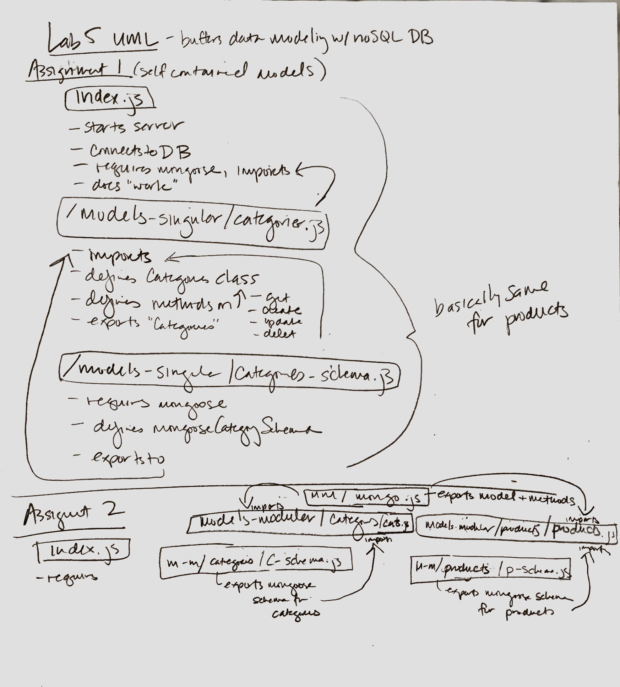

# lab-05-buffers-data-modeling-with-nosql-dbs

## Buffers - Data Modeling with NoSQL Databases

### Author: Gina Pultorak

### Links and Resources
* [submission PR](https://github.com/ginapult-401-advanced-javascript/lab-05-buffers-data-modeling-with-nosql-dbs/pulls)
* [travis](https://travis-ci.com/ginapult-401-advanced-javascript/lab-05-buffers-data-modeling-with-nosql-dbs)
* [front-end](https://ginapult-deploymentworkshop.herokuapp.com/) (when applicable)

#### Documentation
* [jsdoc](https://lab-05-buff-data-mod-nosql-db.herokuapp.com/docs/) (Server assignments)

### Modules
#### `mongo.js`
##### Exported Values and Methods

###### `get(_id) -> {*}`
Returns one or more records by id

###### `creates(record) -> {*}`
Creates a new record based on model/schema

###### `update(_id, record) -> {*}`
Updates record in database with new specified record

###### `delete(_id) -> {*}`
Deletes a record by id

### Setup
#### `.env` requirements
* `PORT` - 3000
* `DB_CONNECT` - URL for running MongoDB Atlas DB

#### Running the app
* `npm start`
* Endpoint: `/`
  * Returns ???
* Endpoint: `/docs`
  * Returns JSDoc Documentation Pages.
  
#### Tests
* Unit Tests: 'npm test'
* Lint Tests: 'npm run lint'

Incomplete Tests:
- Update products test failing

#### UML

